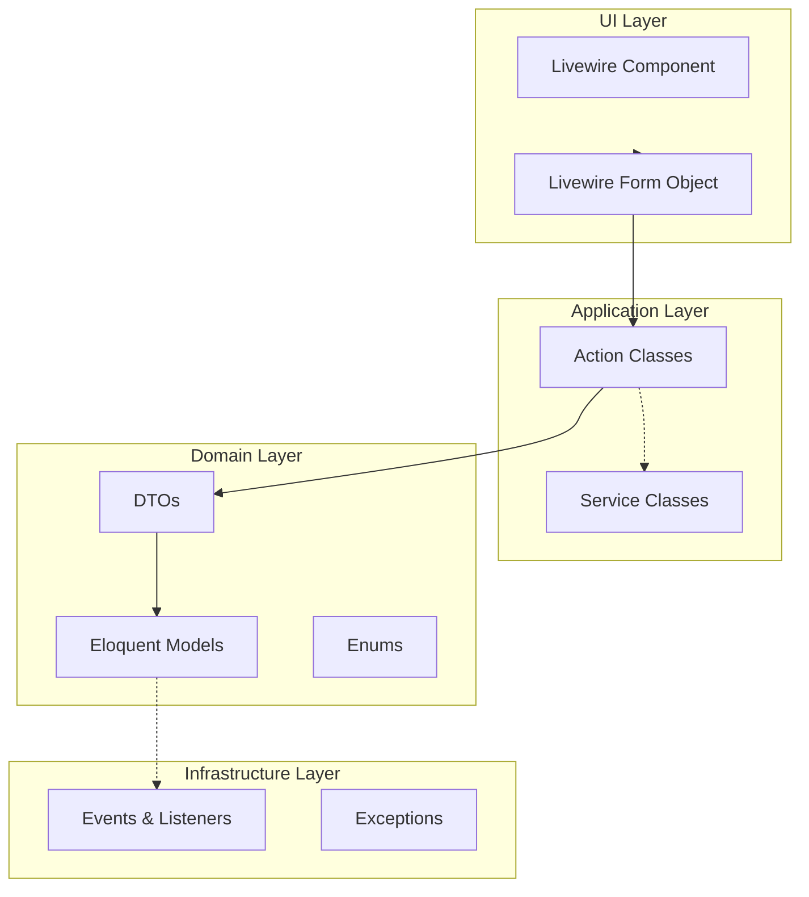

# خطة إغلاق السنة الأكاديمية - مواصفات معمارية

**تاريخ المراجعة:** 2026-02-05  
**الحالة:** جاهزة للمراجعة

---

## 0. مخطط تدفق البيانات (Architecture Layers)

---

## 1. القاعدة الذهبية

1. **لا كتابة بعد الإغلاق** إلا عبر Amendments للأدمن مع سبب و Audit
2. **كل كتابة تمر عبر Actions** وفيها Guard سنة/ترم
3. **الجاهزية Readiness تقرير قراءة فقط**
4. **الإغلاق يتم عبر Wizard** بخطوات واضحة

---

## 2. قائمة PRs

| PR | العنوان | يعتمد على |
|----|--------|----------|
| PR-1 | Academic Write Guards | - |
| PR-2 | Readiness Report + Badges | PR-1 |
| PR-3 | Weekly Reminders | PR-2 |
| PR-4 | Admin Amendments | PR-1 |
| PR-5 | Close Year Wizard UI | PR-2 + PR-4 |

---

## 3. متطلبات كل PR

### PR-1: Academic Write Guards

**الملفات الجديدة:**
- `app/Domains/Academic/Services/AcademicWriteGuard.php`

**الملفات المعدلة:**
- `RecordStudentAttendanceAction.php`
- `GradeSyncService.php`
- `CalculateTermGradesAction.php`
- `AssignStudentToClassAction.php`
- `AssignSessionAction.php`
- `CalculateAnnualResultsAction.php`

**المواصفات:**
- `assertYearNotClosed(int $academicYearId)`: يرمي `ResourceNotFoundException` أو `InvalidOperationException`
- `assertTermNotCompleted(int $termId)`: يرمي exceptions مناسبة
- `assertWritable(int $yearId, ?int $termId)`: دمج

---

### PR-2: Readiness Report + Badges

**الملفات الجديدة:**
- `app/Domains/Academic/Data/ReadinessItem.php`
- `app/Domains/Academic/Services/ReadinessService.php`

**الملفات المستخدمة:**
- `AcademicYearClosureValidator.php` (موجود)
- `AnnualResult::pending()` (scope موجود)
- `StudentEnrollmentQueryService::eligibleForClosureCount()` (موجود)

**المواصفات:**
- Blocking Badges: `terms_not_completed`, `annual_results_pending`, `promotion_incomplete`
- Warning Badges: `attendance_missing_sessions`, `marks_missing_entries`
- كل Badge يحتوي: key, severity, label, message, count, route, routeParams

---

### PR-3: Weekly Reminders

**الملفات الجديدة:**
- `app/Domains/Academic/Notifications/WeeklyReadinessReminder.php`
- `app/Jobs/SendWeeklyReadinessReminders.php`

**المواصفات:**
- يستدعي `ReadinessService::getTeacherReadiness()`
- يرسل فقط Warnings
- يُسجل في Scheduler (حسب نسخة Laravel)

---

### PR-4: Admin Amendments

**الملفات الجديدة:**
- `app/Domains/Academic/Grading/Actions/AmendStudentMarkAction.php`
- `app/Domains/Academic/Attendance/Actions/AmendAttendanceAction.php`

**المواصفات:**
- التحقق من صلاحية `can('amend.grades')`
- سبب إلزامي
- Audit Log (إن وجد موجود، وإلا TODO لجدول لاحق)

---

### PR-5: Close Year Wizard UI

**الملفات الجديدة:**
- `app/Livewire/Academic/YearClosingWizard.php`
- `resources/views/livewire/academi
year-closing-wizard.blade.php`

**المواصفات:**
- Step 1: Readiness Snapshot (Blocking + Warning)
- Step 2: Final Checks
- Step 3: Close Year (يستدعي `CloseAcademicYearAction` الموجود)

---

## 4. قائمة الإجراءات المقفلة بعد الإغلاق

| المجال | الإجراء | Guard المطلوب |
|--------|--------|--------------|
| Attendance | `RecordStudentAttendanceAction` | assertYearNotClosed |
| Grading | `CalculateTermGradesAction` | assertTermNotCompleted |
| Grading | `GradeSyncService` | assertYearNotClosed + assertTermNotCompleted |
| Enrollment | `AssignStudentToClassAction` | assertYearNotClosed |
| Timetable | `AssignSessionAction` | assertYearNotClosed |
| Results | `CalculateAnnualResultsAction` | assertYearNotClosed |

---

## 5. ملاحظات تنفيذ

### استثناءات متوافقة مع المشروع

- `ResourceNotFoundException::forModel(Model::class, $id)`
- `InvalidOperationException::make($message)`

### Scopes موجودة للاستخدام

- `AnnualResult::pending()`
- `Term::active()`
- `AcademicYear::active()`

---

## 6. PR منفصل مستقبلي

**PR-6: Parent Absent Notifications** (بعد اكتمال الإغلاق)

- تصحيح import في `SendAbsentNotification.php`
- تفعيل إرسال الإشعارات
- تسجيل Listeners في EventServiceProvider
